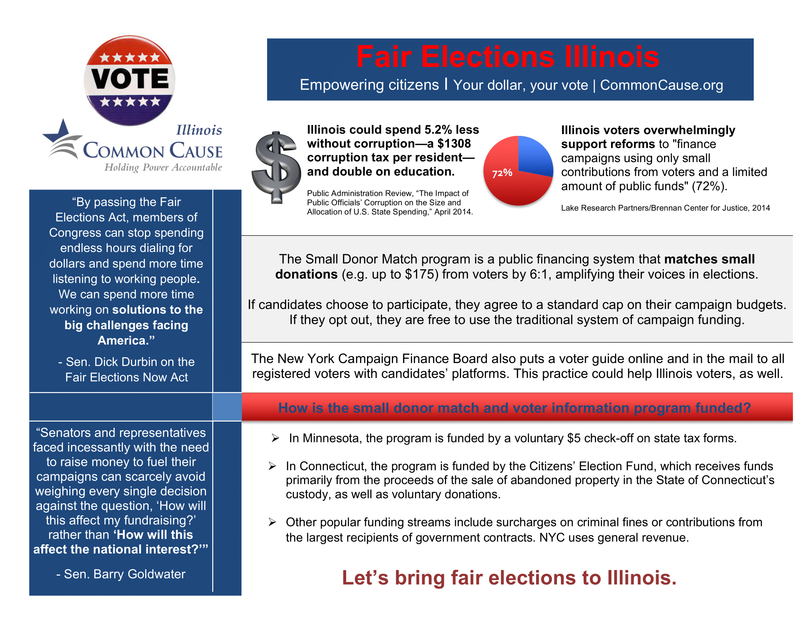

I designed a logo and publicity materials for Fair Elections Illinois, a campaign finance reform initiative by Common Cause Illinois.

The organization had planned several publicity events, and needed flyers to succicntly communicate information about the initiative to passersby. The original version of the flyer was much too crowded, and lacked visual cues for the reader. Moreover, the layout was inconvenient; since most people read left-to-right, it didn't make sense to place testimonials on the far left of the page, before readers even understood the campaign's goals.

I re-designed the flyer to more effectively communicate the issue to a busy, minimally-invested reader. I re-organized the sections to correspond to a logical flow of information, re-worded the copy more succinctly, and added visual demarcations between sections.

Additionally, the organization directors wanted a large visual to display on CTA public transit. They wanted to communicate a "vote responsibly" message, akin to a Surgeon General's warning.

